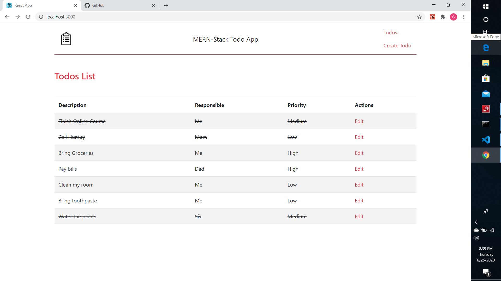
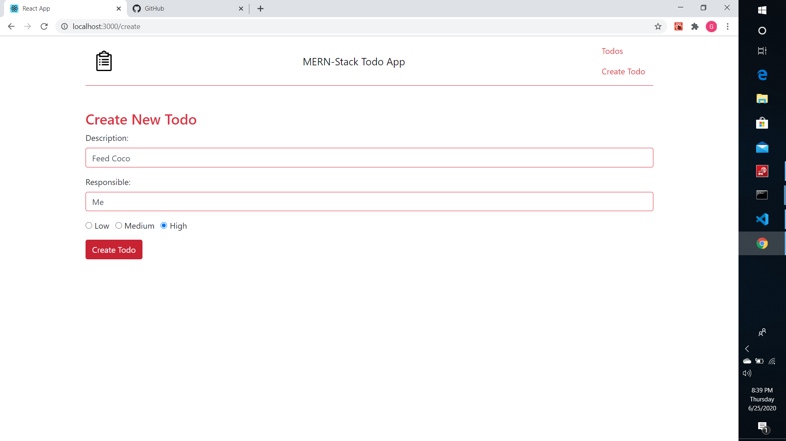
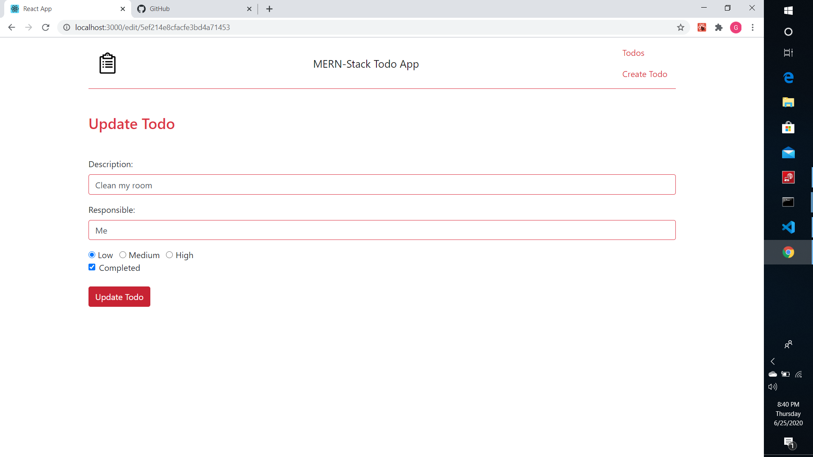
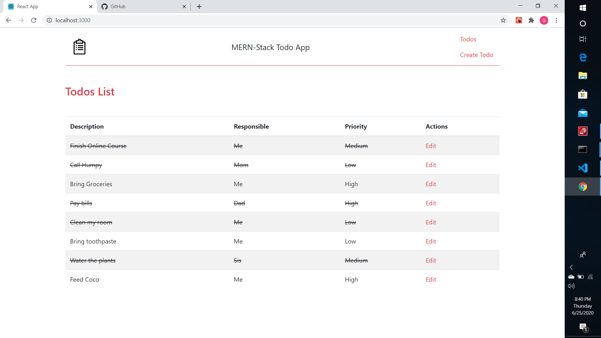

# MERN-todoapp

This project is a CRUD based web application to manage our list of todos, developed using MERN Stack.

Snapshots of working application:

Homepage:

Create Todo section:

Edit Todo Section:

View Changes:

